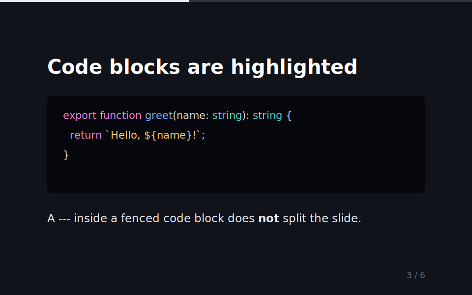

# Deckhand

**▶ Live demo — [apps.charliekrug.com/deckhand](https://apps.charliekrug.com/deckhand/)**

[](https://github.com/ctkrug/mdslides/actions/workflows/ci.yml)
[](LICENSE)

**Markdown in, one self-contained HTML deck out.**

Deckhand is a command-line tool (installed as `mdslides`) for developers and technical speakers
who draft talks in Markdown. It reads a `.md` file and writes a single `.html` file you can open,
email as an attachment, or hand to a conference A/V laptop. No dev server, no SPA to build, no
internet at presentation time.

```bash
npx mdslides talk.md -o talk.html
```



## Why

Writing slides in Markdown is fast and diffable in git, but the popular tools turn the *output*
into a new dependency. reveal.js and Slidy hand you a framework's worth of files or a hosted
viewer. Slidev is excellent, but sharing a deck means running a Vue dev server or shipping a whole
SPA. Marp is close in spirit, yet its CLI still pulls in an asset pipeline. Deckhand optimizes for
the common case: you wrote a Markdown file, you want one HTML file that just works when it is
double-clicked, offline, on someone else's machine.

## Quick start

```bash
npx mdslides talk.md -o talk.html          # write talk.html next to talk.md
npx mdslides talk.md --theme dark --progress
```

Or build the bundled sample deck to see every feature at once:

```bash
git clone https://github.com/ctkrug/mdslides.git && cd mdslides
npm install && npm run build
node dist/cli.js examples/demo.md -o demo.html --theme dark --progress
```

Open the result in any browser. Arrow keys, space, or a click advance the deck; `f` toggles
fullscreen; `n` toggles speaker notes.

## Usage

```
mdslides <input.md> [options]

Options:
  -o, --output <path>  output HTML file path (default: <input>.html)
  -t, --theme <name>   default | dark | minimal (default: "default")
  --css <path>         custom CSS file layered on top of the theme
  --watch              rebuild the output whenever the input (or --css) changes
  --progress           show a progress bar reflecting position in the deck
  --no-counter         hide the "N / total" slide counter
  -V, --version        print the installed version
```

## Features

- **Markdown to HTML deck**: a `---` on its own line splits slides; standard Markdown (headings,
  lists, code blocks, images, tables, blockquotes, emphasis) renders as expected.
- **One portable file**: theme CSS and navigation JS are inlined, and local images are read in and
  embedded as base64 data URIs, so the output is always a single file with no sidecar assets.
- **Three built-in themes**: `default` (light sans), `dark`, and `minimal` (serif), selectable with
  `--theme`, plus a `--css` file layered on top for per-deck overrides.
- **Keyboard and click navigation**: arrow keys, space, and click move through the deck; `f` goes
  fullscreen; an optional progress bar and a slide counter show position.
- **Speaker notes**: text in `<!-- note: ... -->` comments is pulled out of the slide body into a
  notes panel toggled with `n`, so it never shows on screen.
- **Incremental reveal**: a slide starting with `<!-- incremental -->` reveals its list items one
  keypress at a time instead of showing the whole list at once.
- **Build-time syntax highlighting**: fenced code blocks are highlighted with `highlight.js` when
  the deck is built, so the output ships static colored spans and CSS, not a highlighter runtime.
- **Watch mode**: `--watch` rebuilds the output whenever the source Markdown or the `--css` file
  changes, for a tight edit-and-refresh loop.

## Exporting to PDF

A deck is one HTML file, so printing it to PDF works with any headless Chrome or Chromium:

```bash
mdslides talk.md -o talk.html
google-chrome --headless --disable-gpu --print-to-pdf=talk.pdf --no-pdf-header-footer \
  --print-to-pdf-no-header file://$(pwd)/talk.html
```

Each `.slide` fills the viewport, so Chrome paginates section by section. If the default
pagination does not match your slide boundaries, add a print override via `--css` that sets each
`.slide` to `page-break-after: always`.

## How it works

Slides are separated by a horizontal rule (`---`) on its own line, the convention used by Marp and
Slidy, so existing decks mostly just work. A hand-written, fence-aware line splitter finds the
slide boundaries first (a `---` inside a fenced code block never splits a slide), then
[`marked`](https://marked.js.org/) renders each slide's Markdown to HTML. The rendered slides are
stitched into one document with the theme CSS and navigation JS inlined. The result is a flat file:
no external assets, no network requests, no build directory to manage.

## Stack

- **TypeScript on Node.js**, published as an npm package with a single `mdslides` binary.
- **Parsing**: a fence-aware splitter for slide boundaries, then `marked` for Markdown to HTML.
- **Highlighting**: `highlight.js`, run at build time so nothing highlighter-related ships in the
  output.
- **Testing**: `vitest` over the parser, renderer, and a CLI suite that spawns the built binary
  against fixtures; CI runs lint, build, and tests on Node 18 and 20.

See [`docs/VISION.md`](docs/VISION.md) for the design rationale and
[`docs/ARCHITECTURE.md`](docs/ARCHITECTURE.md) for a module map.

## Contributing

Setup, commands, and commit style are in [`CONTRIBUTING.md`](CONTRIBUTING.md).

## License

MIT, see [LICENSE](LICENSE).

---

More of Charlie's projects → [apps.charliekrug.com](https://apps.charliekrug.com)
